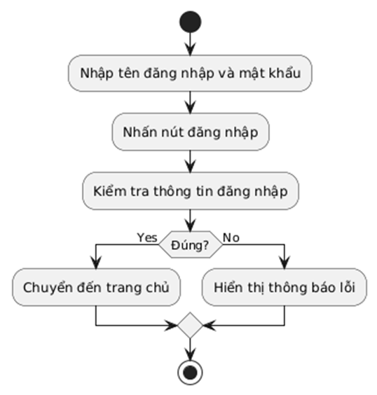

# CodeJudge - Nền tảng chấm code tự động

CodeJudge là một nền tảng web dành cho việc học tập và luyện tập lập trình, cung cấp khả năng chấm code tự động và tạo bài tập lập trình. Dự án được xây dựng bằng PHP thuần với kiến trúc MVC.

## Yêu cầu hệ thống

- **Web Server**: XAMPP (Apache + MySQL + PHP)
- **PHP**: Phiên bản 7.4 trở lên
- **MySQL**: Phiên bản 5.7 trở lên
- **Extensions**: PDO, PDO_MySQL, JSON
- **Ngôn ngữ lập trình** (để chấm code):
  - Python 3
  - Node.js (JavaScript)
  - Java JDK
  - GCC (C/C++)

## Cài đặt và khởi động

### Bước 1: Chuẩn bị môi trường

1. **Tải và cài đặt XAMPP**
   - Tải XAMPP từ [https://www.apachefriends.org/](https://www.apachefriends.org/)
   - Cài đặt và khởi động Apache và MySQL

2. **Sao chép dự án**
   ```bash
   # Sao chép thư mục CodeJubge vào htdocs của XAMPP
   # Thường là: C:\xampp\htdocs\CodeJubge
   ```

### Bước 2: Cấu hình cơ sở dữ liệu

1. **Chỉnh sửa cấu hình** (nếu cần)
   - Mở file `config/config.php`
   - Kiểm tra các thông số kết nối database:
   ```php
   define('DB_HOST', 'localhost');
   define('DB_NAME', 'code_judge');
   define('DB_USER', 'root');
   define('DB_PASS', '');
   ```

2. **Tạo cơ sở dữ liệu tự động**
   - Chạy lệnh để khởi động dự án: 
   ```terminal
   php -S localhost:8000 -t public
   ```
   - Chạy lệnh để setup database: 
   ```terminal
   http://localhost:8000/setup_database.php`
   ```

### Bước 3: Khởi động ứng dụng

1. **Khởi động XAMPP**
   - Mở XAMPP Control Panel
   - Start Apache và MySQL

2. **Truy cập ứng dụng**
   - Mở trình duyệt và truy cập: `http://localhost:8000/`

3. **Hoặc sử dụng VS Code Task**
   - Trong VS Code, nhấn `Ctrl+Shift+P`
   - Chọn `Tasks: Run Task` → `Start XAMPP Server`

## Cấu trúc dự án

```
CodeJubge/
├── app/                        # Thư mục ứng dụng chính
│   ├── controllers/           # Controllers (xử lý logic)
│   │   ├── DiscussionController.php
│   │   ├── leaderboardController.php
│   │   ├── pagesController.php
│   │   ├── ProfileController.php
│   │   └── UserController.php
│   ├── core/                  # Core framework
│   │   ├── App.php           # Ứng dụng chính
│   │   └── Controller.php    # Base controller
│   ├── database/             # Database scripts
│   │   └── createDatabase.sql
│   ├── helpers/              # Helper classes
│   │   ├── AvatarHelper.php
│   │   ├── LeaderboardHelper.php
│   │   ├── NotificationHelper.php
│   │   └── ProblemHelper.php
│   ├── models/               # Models (tương tác database)
│   │   ├── DiscussionModel.php
│   │   ├── ProblemModel.php
│   │   └── UserModel.php
│   └── views/                # Views (giao diện người dùng)
│       ├── components/       # Các component tái sử dụng
│       ├── layouts/          # Layout templates
│       └── *.php            # Các trang view
├── config/                   # Cấu hình
│   ├── config.php           # Cấu hình chính
│   └── databaseConnect.php  # Kết nối database
├── public/                   # Thư mục public
│   ├── assets/              # Tài nguyên static
│   ├── css/                 # Stylesheets
│   ├── js/                  # JavaScript files
│   └── index.php           # Entry point
├── routes/                   # Định tuyến
│   └── web.php             # Routes definition
├── temp/                     # Thư mục tạm (code execution)
└── setup_database.php       # Script thiết lập database
```
### Entity Diagram


### Usecase Diagram

+ Hình 1: Biểu đồ usecase tổng quát


+ Hình 2: Biểu đồ usecase tổng quát của quản lý bài toán


+ Hình 3: Biểu đồ usecase tổng quát của chấm bài tự độ


+ Hình 4: Biểu đồ usecase tổng quát của bảng xếp hạng


+ Hình 5: Biểu đồ usecase tổng quát của diễn đàn thảo luận

+ Hình 2: Biểu đồ usecase quản lý cuộc thi

### Activity Diagram

+ Hình 1:  Biểu đồ hoạt động tổng quát


+ Hình 2: Biểu đồ usecase quản lý cuộc thi


+ Hình 3: Biểu đồ hoạt động đăng nhập tài khoản


+ Hình 4: Biểu đồ hoạt động nộp bài và chấm bài tự động


+ Hình 5: Biểu đồ hoạt động tham gia diễn đàn thảo luận


+ Hình 6: Biểu đồ hoạt động tham gia cuộc thi